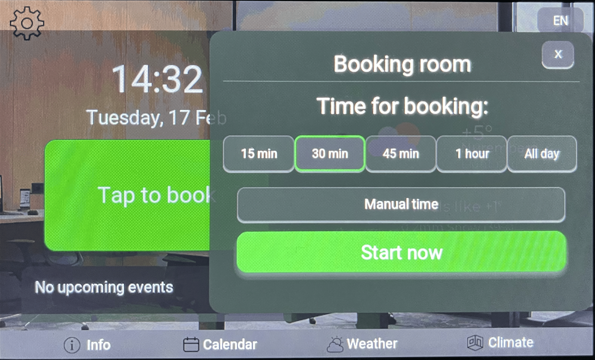

# CrowPanel Meeting Room - ESP32S3

**CrowPanel Meeting Room** is a full-featured firmware for smart control of meeting rooms and conference spaces, built for the ELECROW CrowPanel Advance platform with a touchscreen and cloud service support.

## 📋 Description

The firmware is intended for the ELECROW CrowPanel Advance (5.0″ and 7.0″ variants) based on the ESP32-S3 with a display resolution of 800×480 pixels.
The application supports both hardware revisions (v1.0 and v1.1) and automatically detects the board revision at startup.

The system provides an intuitive touch interface for managing a meeting room schedule, booking time slots, displaying weather information, and monitoring indoor air quality.

---

## ⚙️ System Requirements

Before installation make sure you have:

* **Operating System:** Windows 10 or Windows 11 (64-bit)
* **USB driver:** CP210x USB-to-UART (for board communication)
* **Connection:** USB-C cable to connect the board to your computer

---

## ✨ Key Features

### 🗓️ Meeting Management

* **Room booking** — create and edit bookings directly from the panel
* **Google Calendar integration** — automatically display schedule from a cloud calendar
* **Schedule view** — clear representation of upcoming meetings on the screen

### 🌤️ Weather Information

* **Mini weather widget** — compact info on the dashboard (current temperature and conditions)
* **Detailed weather screen** — a dedicated screen with extended weather data
* **3-day forecast** — planning assistance using the short-term forecast

### 💨 Air Quality Monitoring

* **IAQ (Indoor Air Quality) index** — assessment of indoor air quality
* **CO₂ level** — monitoring of carbon dioxide concentration

### 🌐 Localization

* **Supported languages:** English (default), Deutsch (German)

### 😴 Sleep / Power Saving Mode

* **Auto sleep** — the device automatically enters a low-power mode after 5 minutes of inactivity (no touchscreen interaction)
* **Quick wake** — any touch instantly wakes the device and returns it to full operation

### 📱 Wireless Connectivity

* **Wi-Fi** — full wireless connectivity support
* **Cloud sync** — calendar and weather data fetched via the internet

---

## 📺 Available Screens

| Screen                      | Function                                                                        |
| --------------------------- | ------------------------------------------------------------------------------- |
| **Main Screen (Dashboard)** | Current time, mini weather widget, current meeting status, quick action buttons |
| **Calendar**                | List of all meetings with times and titles from the connected calendar          |
| **Weather**                 | Detailed weather information, 3-day forecast, temperature charts                |
| **Climate**                 | Indoor air quality monitoring (IAQ) and CO₂ level (requires EnSens module)      |
| **Booking**                 | Create new bookings                                                             |
| **Settings**                | Language selection, Wi-Fi setup, configure data sources for Google Calendar     |

## Main Screen (Dashboard)


## Weather Screen (Weather)


## Booking Screen (Booking room)



---

## 🚀 Installation Guide

### Step 1: Flash the firmware

1. **Connect the board to your computer** via a USB-C cable.

2. **Run the flasher utility:**

   * Locate `flash_tool.exe` in the repository
   * Run it — the tool will automatically detect the COM port
   * Make sure the CP210x driver is installed on your system
   * Follow the on-screen instructions

3. **Wait for completion:**

   * Flashing takes a few minutes
   * After the process finishes the board will automatically reboot
   * The main application screen will appear on the display

### Step 3: Connect to Wi-Fi

You can send Wi-Fi credentials using the app or the companion tool `CrowPanelConfiguration.exe`:

1. **Open the configuration utility** on your PC
2. **Enter Wi-Fi details:**

   * SSID (network name)
   * Network password
3. **Select the COM port** that the board is connected to
4. **Click "Send"** to transmit the configuration

Wi-Fi credentials are stored in the device non-volatile memory and used automatically on every boot.

### Step 4: Connect Google Calendar (optional)

To show events from Google Calendar:

1. **Get the ICS link:**

   * Open Google Calendar on your computer or smartphone
   * Under **My calendars** find the calendar you want
   * Click the three dots (⋮) next to the calendar name
   * Choose **Settings and sharing**
   * Scroll down to **Integrate calendar**
   * Copy the **Secret address in iCal format** — this is the ICS link you need

2. **Send the link to the device:**

   * Use `CrowPanelConfiguration.exe`
   * Paste the ICS URL
   * Select the device COM port
   * Click **Send**

3. **Verify:**

   * Open the **Calendar** screen on the panel
   * Check that your events appear

### Step 5: Connect the air quality module (optional)

If you want to monitor air quality:

1. **Install the EnSens module:**

   * Locate the W-M connector on the board
   * Gently insert the EnSens module into that connector

2. **Check pin orientation:**

   * The board has markings next to the connector
   * Make sure the module is aligned with the 0/1 markings

3. **Use the Climate screen:**

   * From the dashboard open the **Climate** screen — IAQ and CO₂ values should be displayed

---

## 📁 Repository Structure

```
Meeting-room/
├── README.md                      
├── Binaries/ - folder with binaries to flash to your panel
├── flash_tool.exe - automatic flasher for your panel
├── CrowPanelConfiguration.exe - configuration tool (Wi-Fi, calendar setup)
```

---

## 🔧 Technical Specifications

| Parameter               | Value                                 |
| ----------------------- | ------------------------------------- |
| **Microcontroller**     | ESP32-S3                              |
| **Display resolution**  | 800 × 480 pixels                      |
| **Display type**        | TFT LCD with touch                    |
| **Enclosure**           | ELECROW CrowPanel Advance 5.0″ / 7.0″ |
| **Supported revisions** | v1.0, v1.1 (auto-detection)           |
| **Interfaces**          | WiFi 802.11 b/g/n, USB-C (UART)       |
| **RAM**                 | 8 MB PSRAM                            |
| **Flash**               | 16 MB QSPI Flash                      |

---

## 📊 Data Sources

| Feature         | Source                    | Requirements                        |
| --------------- | ------------------------- | ----------------------------------- |
| **Calendar**    | Google Calendar (via ICS) | Internet connection, Google account |
| **Weather**     | OpenWeatherMap API        | Internet connection                 |
| **Air quality** | EnSens module (local)     | Connected sensor module             |
| **Time**        | NTP server                | Internet connection                 |

---

## ⚡ Quick Start

```
1. Flash the firmware using flash_tool.exe
2. Connect to Wi-Fi using the built-in configuration UI
3. Add your Google Calendar ICS link
4. (Optional) Attach the EnSens air quality module
5. Start using the application!
```

---

## 🐛 Troubleshooting

### Problem: The screen does not turn on after flashing

**Solution:**

* Check the USB cable connection
* Ensure the firmware flashed without errors
* Try power-cycling the board
* If the problem persists, repeat the flashing process

### Problem: Board not detected as a COM port

**Solution:**

* Make sure the CP210x driver is installed: [https://www.silabs.com/developers/usb-to-uart-bridge-vcp-drivers](https://www.silabs.com/developers/usb-to-uart-bridge-vcp-drivers)
* Try a different USB cable
* Reboot your PC
* Check Device Manager for unknown devices

### Problem: Wi-Fi does not connect

**Solution:**

* Verify the Wi-Fi password is correct
* Ensure you are connecting to a 2.4 GHz network (ESP32-S3 does not support 5 GHz)
* Try power-cycling the board

### Problem: Calendar does not show events

**Solution:**

* Ensure the ICS link is copied completely and is correct
* Check the board’s internet connection
* Make sure the Google Calendar actually contains events for the selected dates
* Try sending the ICS link again

### Problem: EnSens module not detected

**Solution:**

* Ensure the module is fully and correctly seated in the W-M connector
* Confirm the module orientation matches the 0/1 markings
* Remove and reinsert the module, then reboot the board

---

## 📋 Known Limitations

* Active internet connection is required for weather and calendar data
* Weather updates occur every 10 minutes
* Calendar updates occur every 5 minutes
* Maximum number of calendar events per day: 50
* Default system language: English

---

## 🔐 Security & Privacy

* **Cloud data:** Google Calendar access uses secure HTTPS connections
* **Local storage:** Weather and calendar data are stored locally on the device and not synchronized elsewhere

---

## 📦 Installing the CP210x driver

If the board is not recognized by your PC:

1. Go to [https://www.silabs.com/developers/usb-to-uart-bridge-vcp-drivers](https://www.silabs.com/developers/usb-to-uart-bridge-vcp-drivers)
2. Download the driver for Windows (64-bit)
3. Install the driver following the vendor instructions
4. Reboot your computer
5. Connect the board — it should appear in Device Manager

---
